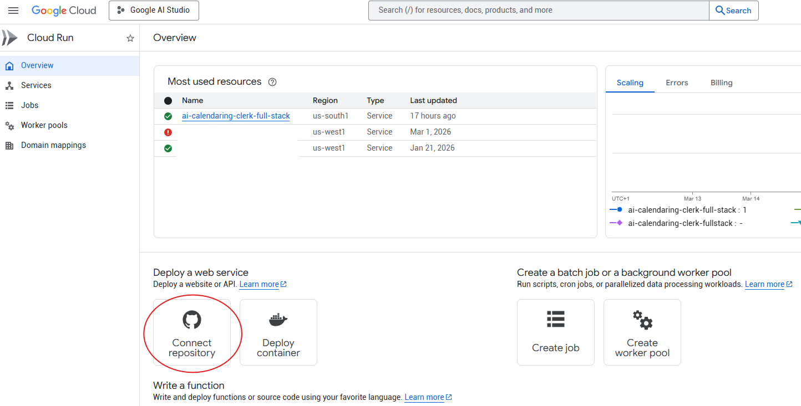
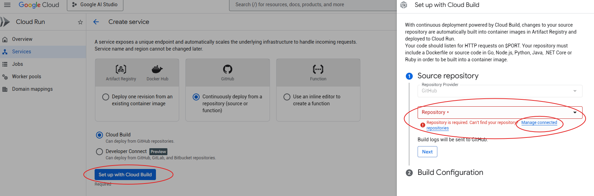
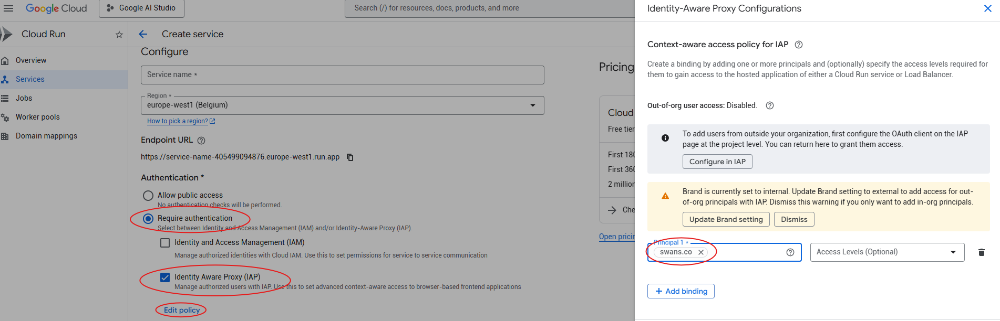
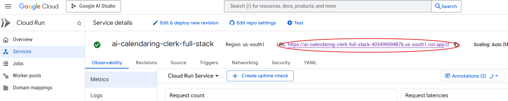
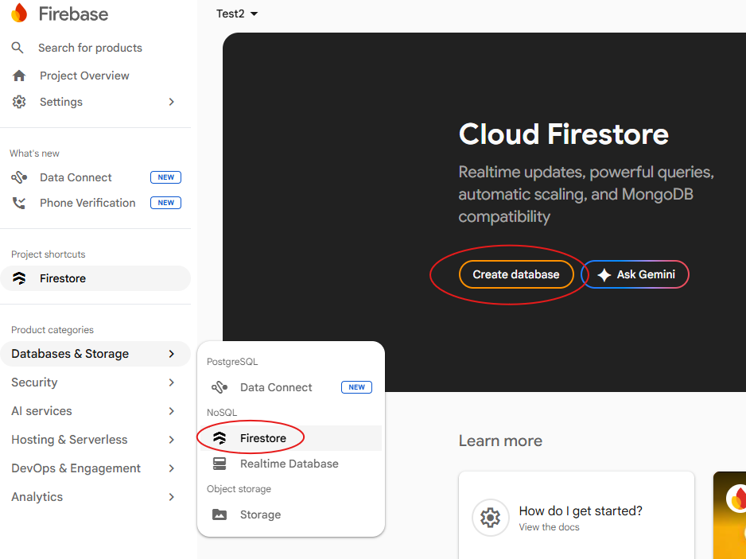
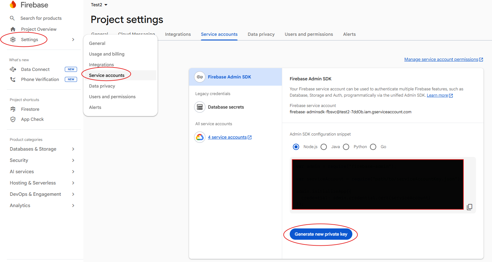
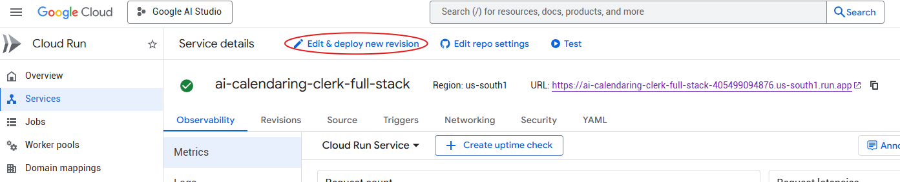
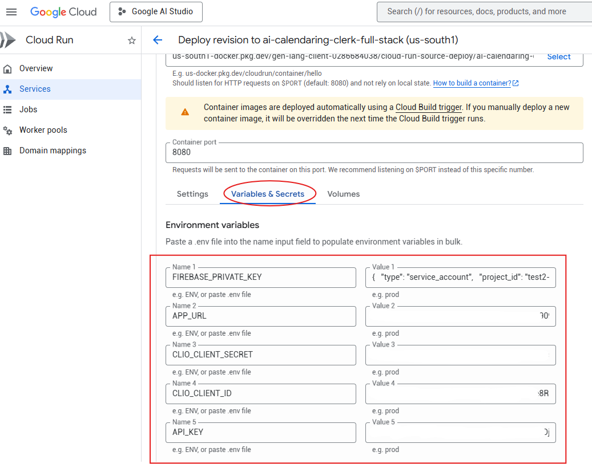

# AI Calendaring Clerk - Full Stack

An advanced, full-stack legal docketing assistant designed for law firms to analyze legal documents (PDFs), extract precise schedules, apply firm-specific SOPs (Standard Operating Procedures), and synchronize everything with Clio Manage.

> **Want to try this yourself?** A step-by-step deployment guide is included at the bottom of this document — no prior technical experience required.

## 🚀 Overview

The AI Calendaring Clerk V2 automates the complex process of docketing by combining Google's Gemini AI with deep integrations into legal practice management software. It doesn't just extract dates; it understands the context, applies your firm's specific rules (reminders, calendar mappings), and syncs them directly to your system of record.

## ✨ Key Features

- **Intelligent PDF Analysis**: High-fidelity PDF processing using `pdfjs-dist` combined with Gemini's reasoning capabilities.
- **Automated Date Calculation**: Identifies "trigger" events and automatically computes relative deadlines (e.g., "10 days after service").
- **Clio Manage Integration**: Secure OAuth 2.0 connection to Clio Manage for real-time access to users and calendars.
- **SOP Rules Engine**: Configure firm-wide rules in a dedicated dashboard. Map extracted events to specific Clio calendars and set automatic reminders (Email or Calendar).
- **Dynamic Descriptions**: AI-powered description enrichment that fills placeholders (e.g., `[Matter Name]`) with actual data from the document.
- **Source Verification**: Provides 1:1 verbatim quotes and page numbers for every extracted date, with integrated visual highlighting in the built-in PDF viewer.
- **Secure Architecture**: Sensitive operations (OAuth, API integrations, Firestore) are handled server-side with HTTP-only cookies and proxy endpoints.

## 🛠️ Tech Stack

- **Frontend**: React 19, Framer Motion, Lucide React, Tailwind CSS.
- **Backend**: Node.js, Express, WebSockets (`ws`).
- **AI Engine**: Google Gemini API (`@google/genai`).
- **Database**: Firebase Firestore (for SOP rules).
- **Integrations**: Clio Manage API (OAuth 2.0).

## 📋 How to Use

1. **Configure SOPs**: Navigate to the **SOP Dashboard** to define how specific court events should be handled (which calendar they go to, what reminders to add).
2. **Connect Clio**: Click **Connect Clio** to authorize the application.
3. **Upload**: Drag and drop a legal PDF (e.g., a Scheduling Order).
4. **Analyze**: The AI extracts dates, matches them against your SOPs, and applies your rules.
5. **Review & Verify**: 
   - Use the side-by-side viewer to verify extracted dates against the source text.
   - Click the **Search** icon to jump to the exact location in the PDF.
6. **Export**: Select events and click **Export to System** to sync them directly with your practice management system.

## ⚖️ Accuracy Disclaimer & Legal Notice

AI can make mistakes. The AI Calendaring Clerk is designed to assist docketing professionals, not replace them. Always use the built-in **Source Verification** tools to confirm the accuracy of every extracted date before finalizing the calendar.

**This software is provided without warranty, express or implied. The authors and contributors shall not be liable for any claim, damages, or other liability arising from the use of this software.**

Missed deadlines and docketing errors can have serious legal consequences. This tool does not constitute legal advice and is not a substitute for qualified legal professionals or proper docketing review procedures. Users assume full responsibility for verifying all dates and deadlines extracted by this application before acting on them.

## 🚀 Deployment Guide

This guide walks you through deploying the AI Calendaring Clerk on Google Cloud Run using your own GitHub and Google Cloud accounts.

### Prerequisites

- A [GitHub account](https://github.com)
- A [Google Cloud account](https://console.cloud.google.com/) with billing enabled
- A [Clio Manage](https://developers.clio.com/) account with developer access

---

### Step 1 — Fork the Repository

A **fork** is your own copy of this codebase hosted under your GitHub account. You'll deploy from your fork, which gives you full control over the code and your own Cloud Run instance.

1. Go to the repository: [github.com/swansgeneral/ai-calendaring-clerk-full-stack](https://github.com/swansgeneral/ai-calendaring-clerk-full-stack)
2. Click **Fork** (top right) → **Create fork**

> **Note:** If updates are published to the original repository, you can sync your fork from GitHub using the **"Sync fork"** button on your fork's page.

---

### Step 2 — Create a Google Cloud Project

1. Go to [console.cloud.google.com](https://console.cloud.google.com/)
2. Click the project dropdown → **New Project**
3. Name your project and click **Create**

---

### Step 3 — Set Up Billing

1. Go to [Billing](https://console.cloud.google.com/billing) and link a billing account to your new project

> Running this app has minimal cost. Aside from standard Cloud Run infrastructure (which has a generous free tier), the only ongoing cost is Gemini API usage — typically a few cents per dozen files analyzed.

---

### Step 4 — Deploy to Cloud Run

1. Go to [Cloud Run](https://console.cloud.google.com/run) and click **Connect repository**

2. Select **"Continuously deploy from a repository"** then click **Set up with Cloud Build**

3. Connect your GitHub account and select your forked repository, set the branch to `main`, and click **Next**

   > **Note:** If no repositories appear, you may need to install the **Google Cloud Build** GitHub App first. Click **Install Google Cloud Build** when prompted, authorize it on your GitHub account, and grant it access to your forked repository. Then return to Cloud Build and your repository will appear in the list.

**Security (recommended):** Enable **Identity-Aware Proxy (IAP)** authentication to restrict access to Google accounts within your domain only.

4. Click **Create** and wait for the initial deployment to complete
5. Once deployed, copy your app URL from the service details page — you will need it in later steps

---

### Step 5 — Set Up Firebase (Firestore Database)

1. Go to [console.firebase.google.com](https://console.firebase.google.com/) and click **Add project**
2. Select the **same Google Cloud project** you created in Step 2
3. Inside your Firebase project, go to **Databases & Storage → Firestore** → **Create database**

4. Choose **Production mode** and select a region close to your users
5. Go to **Settings → Service accounts** → **Generate new private key**
6. A `.json` file will be downloaded — keep it safe, you will need its contents in Step 8

---

### Step 6 — Create a Clio Developer App

1. Go to the [Clio Developer Portal](https://developers.clio.com/) and sign in
2. Click **Create App** and fill in the details:
   - **Name:** anything descriptive
   - **Website URL:** your firm's website (e.g. `https://yourfirm.com`)
   - **Redirect URL:** your app URL + `/api/auth/clio/callback`
     - Example: `https://your-app-405499094876.us-south1.run.app/api/auth/clio/callback`
3. Under **Permissions**, enable **Read and Write** access for the following scopes:
   - API, Calendars, Contacts, Custom Fields, Imports, General, Matters, Users, Webhooks, Custom Actions, Activities
4. Save the app and note down the **Client ID** and **Client Secret**

---

### Step 7 — Get a Gemini API Key

1. Go to [Google AI Studio](https://aistudio.google.com/api-keys)
2. Click **Create API key** and copy it

---

### Step 8 — Add Environment Variables to Cloud Run

1. Go to your Cloud Run service and click **Edit & deploy new revision**

2. Open the **Variables & Secrets** tab and add the following environment variables:

| Variable | Value |
|---|---|
| `FIREBASE_PRIVATE_KEY` | Paste the full contents of the `.json` file downloaded in Step 5 |
| `APP_URL` | Your Cloud Run app URL (e.g. `https://your-app-405499094876.us-south1.run.app`) |
| `CLIO_CLIENT_ID` | From the Clio Developer Portal (Step 6) |
| `CLIO_CLIENT_SECRET` | From the Clio Developer Portal (Step 6) |
| `API_KEY` | Your Gemini API key (Step 7) |

3. Click **Deploy** and wait for the new revision to go live. Your app is now fully configured and ready to use. 
